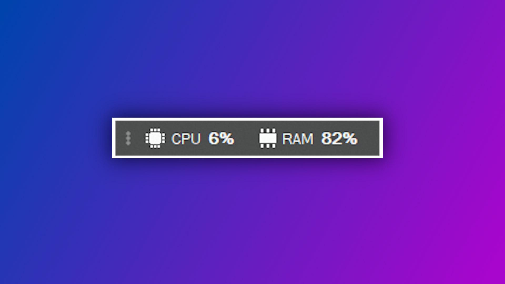

# Performance Manager
Tracks your CPU and RAM usage in a small desktop widget

Update May 2020:
+ Autostart function
+ Some fixes

Known issues:
+ 'X' won't close the application, it will only be minimalized. Try closing the app via Task-Manager if needed.
